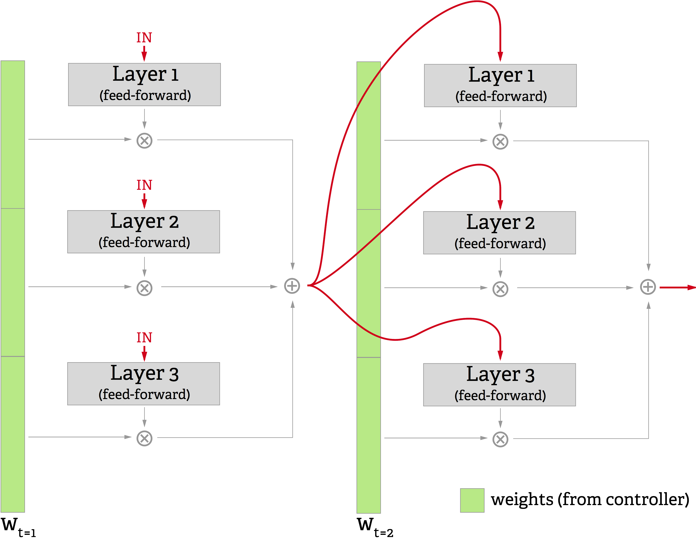

# Introduction

A defining feature of human intelligence is the ability to apply knowledge and techniques learned on one problem to other problems which have similar components. This ranges from the  simplest examples (e.g. playing chess with different-colored pieces than you learned with) to the most complicated (like applying concepts from one domain of mathematics to another). A particular formulation of these problems is referred to as transfer learning.

To date, machine learning algorithms have struggled with transfer learning tasks. In some cases existing techniques perform so poorly as to exhibit "negative transfer", in which seeing examples across new domains causes the learner to perform worse than it did before [@pan2010survey].

With the recent success of deep learning methods in many fields, efforts have been made to apply deep learning techniques to transfer learning problems. Deep learning is at the deepest level a method for hierarchically extracting good representations from complex data, with the higher levels of a network capturing increasingly abstract representations of the data. As such, deep learning seems naively to be a promising direction for transfer learning; abstract representations of the data should be useful for many related tasks, and the network should be able to simply not use any which are not helpful.

## Catastrophic forgetting

This theory has been borne out for simple, highly coupled tasks such as evaluating sentiment of reviews for different categories of products [@glorot2011domain]. A more wide-ranging survey of deep learning methods for transfer learning shows that some classes of models are able to improve their performance on the original, clean dataset after being shown perturbed or distorted versions of the same data [@bengio2012deep].

However, even small changes in the task result in substantial changes to the optimal features, especially at high levels of the network [@yosinski2014transferable]. This can lead to _catastrophic forgetting_, in which the network "unlearns" its original task as it trains on a new one. A recent set of experiments [@goodfellow2013empirical] detail the tradeoff curve for performance on one task versus performance on the other task for both similar and dissimilar tasks. They show that for networks trained on two tasks, improvement on one task comes at a cost to performance on another.

The true goal of such a system should be _function reuse_. Ideally a system for transfer learning would learn a set of distinct functions which it uses to solve a given domain of tasks. Each of these functions would represent a particular transformation of the data relevant to solving the problem. Then when presented with a new domain of tasks, this system would have those functions available and could choose whether or not to use them as appropriate for a given task in the new domain. This reuse would represent shared structure between the two domains.

To achieve this, it will be necessary to draw on recent work in attentional models.

## Attentional models

Recently a very powerful new class of neural networks known as attentional models have shown success on a variety of difficult tasks. The Neural Turing Machine [@graves2014neural] (NTM) performs complex operations on sequences such as sorting or repeatedly copying by using a differentiable addressing mechanism to read and write to an external memory. DRAW [@gregor2015draw] uses a differentiable attention system to selectively read from its input image and write to an output canvas, as shown in [@Fig:draw].

 {#fig:draw}

These systems work by having a Long Short-Term Memory [@hochreiter1997long] (LSTM) controller which produces a weighting distribution over the cells of data structure it indexes. This weighting for each cell is, with some variations in each system, multiplied by the content of the cell and then summed across cells (when reading) or multiplied by the value to write and then added into the cell (when writing).

This attention system allows the network to sequentially

1. Decide on a region of the data to focus on, then
2. Read or edit just that region of the data.

By letting the network sequentially attend to a particular region of the input, this design gives a small attentional network the same power as an enormous one with fixed connectivity. Furthermore, since such a system can decide from one timestep to the next what part of the data is the most important, it can effectively ignore the less diagnostic components of an input or output (e.g., never look at the background of an image).

In this paper, the author proposes a model for transfer learning which addresses the challenge of reusing whichever subroutines are shared between several different tasks without forgetting those subroutines the tasks do not have in common. The proposed system takes the form of an attentional model over components of the network itself.

# Model

{#fig:controller_network}

The proposed model generates an output for a particular timestep via the following steps (shown in [@Fig:controller_network]):

1. The input tensor is fed into the controller
2. The controller decides which layers are most appropriate for processing this input
3. The controller outputs a weighting vector reflecting how much output it wants from each of the layers
4. The input tensor is fed into each layer (in parallel)
5. The outputs from each layer are multiplied by their respective weights from the controller
6. The weighted outputs from all the layers are summed together and output. This is the output of the whole network for this timestep.

Essentially the idea is that at each timestep, the controller examines the input that it gets, then up- or down-regulates the activities of the various "functions" (single-layer NNs) to best deal with this input. Since the controller is an LSTM, it can store information about the inputs it has received before, meaning that in a time series or language setting it can make weighting decisions contextually.

As this model is differentiable throughout, it can be trained with the standard backpropagation through time (BPTT) algorithm for stochastic gradient descent.

By setting weights over each of the layers in the network, the controller scales not only the output of each layer, but also the error gradient that it receives. This means that in a given timestep, the layers which have very low weights on their output will be nearly unchanged by the learning process. That is, functions which are not used are not forgotten.

In an ordinary feedforward neural network, the only way for the network to prevent learning in a particular node is for it to learn connection strengths very near zero for that node. This takes many training examples, and functionally removes that node from the computation graph.

This system, by comparison, can decide that a set of nodes is or is not relevant on an input-by-input basis.

## Multi-step variant

{#fig:multistep}

One obvious question to consider about this model is, "What happens if the correct output function at a timestep is not computable with a linear combination of single-layer networks?" After all, there are functions computable by a polynomial-width network of depth `k` that require exponential width to compute with a network of depth `k-1` [@hastad1986almost].

To address this question, the system could be run for a predefined number of steps between outputs. That is,

1. Feed the system the input for "real-world" time `t` and save the output
2. Repeat `k` times: 
	a. Feed the system its own most recent output
4. Take the `kth` output of the system as its answer for time `t`
5. Repeat from 1. for time `t+1`

This amounts to making the network deeper, in that more layers of computation and nonlinearity lie between the input and the output. This gives it the same computational power of a `k`-depth model.

## Function reuse

The fundamental problem this model attempts to address is that of _function reuse_. Given that two tasks require some of the same computation to solve, can we build a system that only has to learn that computation once?

If this system has learned a function in one task which happens to also solve another task, the error gradients propagated to the controller will consistently increase the weight assigned to that function and decrease that assigned to the other functions. But this depends on a particular subroutine of one task being exactly the solution to another.

One result which provides hope for partial function reuse is given by Yosinski et al. [-@yosinski2014transferable], who showed that a deep network trained to recognize one domain of objects learned to recognize a new domain of objects far faster than an untrained, randomly-initialized network. So clearly there are domains with substantial overlap in their subroutines.

In order to encourage this behavior, it may be necessary to train the network on multiple domains simultaneously, thus letting the functions "coevolve" on all domains and encouraging separation of shared resources from those that are domain-specific.

Whether or not this happens in practice in an experimental question, but the proposed model provides a framework in which it is possible.

## Connections to mixture of experts

This architecture has connections to the mixture of experts model proposed by Jacobs et al. [-@jacobs1991task], in which several different task-specific "expert" networks each contribute in linear combination to the output of the overall network. The model proposed in this paper can be thought of as akin to an "iterated mixture of experts", in which a mixture of experts model is sequentially applied to its own output several times before a final output from the network is produced.

However, this model has two key differences from this "iterated mixture of experts":

1. **The gating network is an LSTM.** This means that the gating network (or controller, in my terminology) can easily learn fixed sequential procedures for certain types of input.
2. **The "expert" networks are extremely simple.** Because the model has memory and is iterated, the expert networks are made as simple as they can be: single layers. This give the controller as much flexibility as possible about how to compose functions instead of just choosing between them.

# Experiments

## Games

One compelling domain for transfer learning is simple arcade games such as Pac-Man or Breakout. Models such as the DQN [@mnih2015human] have been recently shown to perform very well on a subset of these games when trained for one game only, but so far efforts to play multiple games with one network have failed. Even minor perturbations in the visual representation of a game (e.g. changing the colors) require substantial retraining.

The author proposes to test the transfer learning abilities of this system by training it with interleaved examples of two similar games at a time. Pairs of games with different levels of similarity can be constructed by everything from creating minor visual differences in the same game to using different source games (e.g. Breakout versus Space Invaders).

Additionally, it would be interesting to see whether the system can efficiently perform curriculum learning. Curriculum learning is a subset of transfer learning which involves transferring skills learned on easy problems in a domain to harder problems in the same domain. Puzzle games with levels of increasing difficulty, such as Rush Hour, would be an interesting domain for this.

# Discussion

This paper proposes a system capable of taking on challenges in the domain of transfer learning using a model of functional attention. This model consists of an LSTM controller which allots attention and a set of layers which learn functions. By separating the decision of _what to execute_ from the _execution_, this model will prevent the problems of catastrophic forgetting and negative transfer while allowing the reuse of subcomputations which are shared between tasks.

# References

